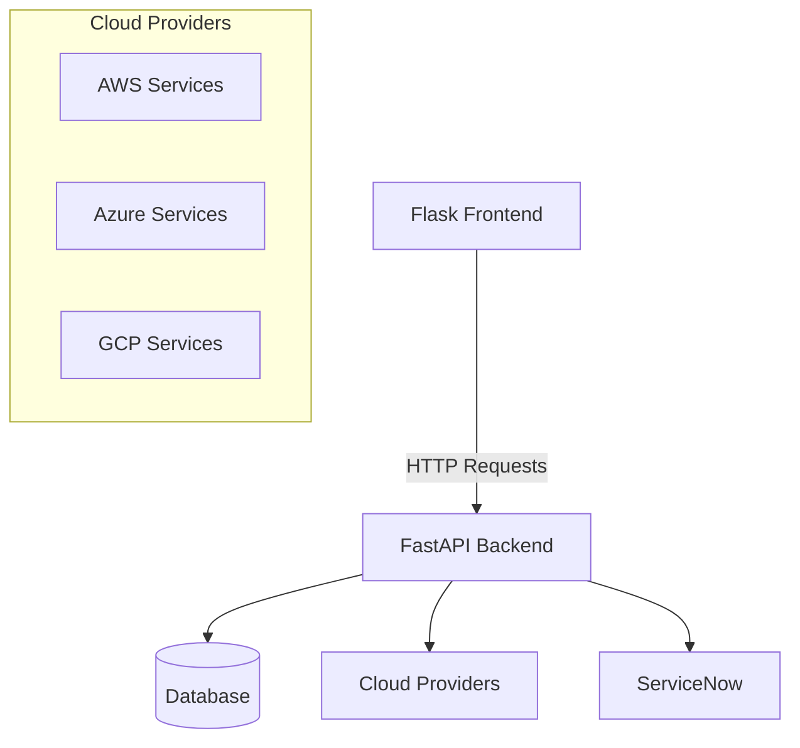

# PCM-Ops Tools

## Overview

PCM-Ops Tools is a comprehensive multi-cloud operations framework designed to simplify and standardize operations across multiple cloud providers (AWS, Azure, GCP) and service integrations (ServiceNow). The platform consists of a FastAPI backend and a Flask frontend, providing a unified interface for various operational tools.

## Current Status

- **Backend**: ✅ Complete and functional with modular architecture
- **AWS Script Runner**: ✅ Fully implemented with credential management and execution tracking
- **Frontend**: 🔄 In development (Flask-based UI)
- **Additional Providers**: 📝 Planned (Azure, GCP, ServiceNow)

## Architecture

The platform follows a modular architecture designed for extensibility:



### Key Design Principles

1. **Provider Isolation**: Each cloud provider has its own module with isolated routes, services, and models
2. **Tool Modularity**: Tools are organized by provider, allowing for easy addition of new capabilities
3. **Shared Utilities**: Common functionality is abstracted into reusable components
4. **API Consistency**: All tools follow a consistent API design pattern
5. **Credential Management**: Secure handling of authentication across different providers

## Project Structure

```bash
PCM-Ops_Tools/                 (repository root)
├── backend/                    (FastAPI application)
│   ├── core/                   (Cloud-agnostic helpers, auth, models)
│   ├── providers/              (Provider-specific implementations)
│   │   ├── aws/
│   │   │   ├── common/         (Shared AWS utilities - credentials, STS)
│   │   │   └── script_runner/  (AWS Script Runner tool)
│   │   └── linux/              (Linux tools scaffold)
│   ├── api/                    (Core API endpoints and routers)
│   ├── db/                     (Database models and migrations)
│   └── tests/                  (Test suite)
├── frontend/                   (Flask frontend - in development)
│   ├── blueprints/             (Provider-specific sections)
│   ├── templates/              (Jinja2 templates)
│   ├── static/                 (CSS, JS, images)
│   └── services/               (API client services)
├── docs/                       (Documentation)
└── infra/                      (Infrastructure code, Docker, k8s)
```

## Features

### Backend API (Implemented)

- **Dynamic Provider Discovery**: Automatic registration of provider-specific API routes
- **Modular Tool Architecture**: Each tool is a self-contained module with its own routes, services, and models
- **Credential Management**: Secure handling of cloud credentials with proper validation and caching
- **Execution Tracking**: Support for long-running operations with state management

### AWS Script Runner (Implemented)

- **Multi-Account Support**: Run scripts across multiple AWS accounts
- **Credential Management**: Automatic validation and refresh of AWS credentials
- **EC2 Instance Discovery**: Find and filter EC2 instances across accounts and regions
- **SSM Command Execution**: Execute scripts on instances via AWS Systems Manager
- **Execution Tracking**: Monitor script execution status and results

### Frontend UI (In Development)

- **Flask Application**: Server-side rendered interface with Jinja2 templates
- **Blueprint Architecture**: Modular frontend matching backend organization
- **Provider-Specific Views**: Dedicated sections for each cloud provider
- **Credential Management**: User-friendly interface for managing cloud credentials
- **Script Management**: Create, edit, and execute scripts with real-time status updates
