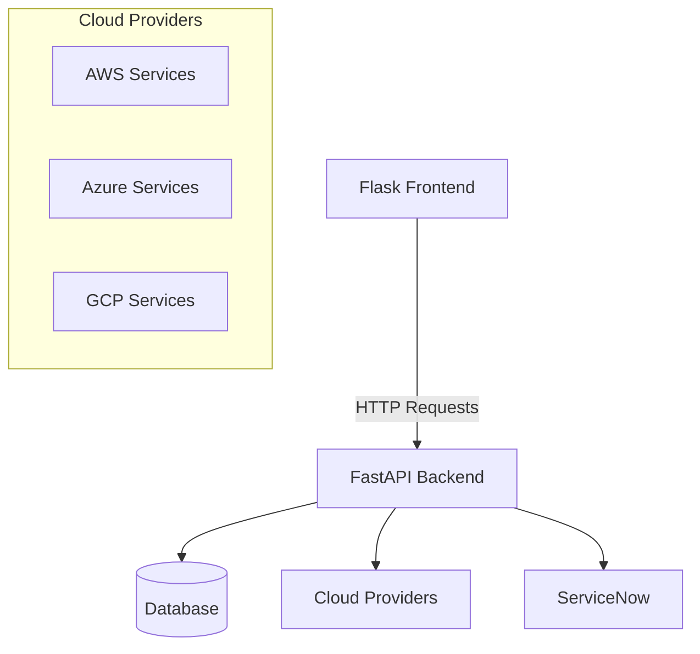

# PCM-Ops Tools Implementation Plan

## Project Overview

The PCM-Ops Tools is a comprehensive tooling framework designed for multi-cloud operations:

- **Backend**: FastAPI service with modular provider architecture - ✅ IMPLEMENTED
- **Frontend**: Flask application with blueprint-based interface - 🔄 IN PROGRESS
- **Providers**: AWS, Azure, GCP, and ServiceNow integration - 📝 PLANNED



## Current Status

- Backend implementation is complete with modular provider architecture
- AWS Script Runner tool is fully functional
- Type issues have been fixed and mypy checks pass successfully
- API endpoints for all core functionality are implemented
- Provider-specific route discovery is working correctly
- Next step is to implement a Flask frontend

## Frontend Implementation Tasks

### 1. Flask Application Setup

- [ ] Create basic Flask application structure
- [ ] Configure session management and CSRF protection
- [ ] Set up blueprint architecture for providers
- [ ] Create static file organization (CSS, JS, images)
- [ ] Implement error handling and logging

### 2. Core Templates and Components

- [ ] Design base template with responsive navigation
- [ ] Create landing page with provider selection
- [ ] Implement shared form components and validators
- [ ] Build notification system for success/error messages
- [ ] Create consistent styling with a modern look

### 3. AWS Blueprint Implementation

- [ ] Create credential management views
  - [ ] AWS credential input form with validation
  - [ ] Credential status display and refresh
  - [ ] Environment selection (com/gov)
- [ ] Implement Script Runner interface
  - [ ] Account and region selection
  - [ ] Instance browsing and filtering
  - [ ] Script management (create, edit, view)
  - [ ] Execution monitoring with real-time updates

### 4. API Client Services

- [ ] Create base API client with error handling
- [ ] Implement credential management client
- [ ] Build AWS Script Runner API client
- [ ] Add WebSocket client for real-time execution updates

### 5. Testing

- [ ] Set up Flask testing infrastructure
- [ ] Create unit tests for client services
- [ ] Implement view tests
- [ ] Add integration tests for full workflows

## Backend Validation and Testing

- [ ] Run comprehensive unit tests to verify functionality
- [ ] Fix any remaining import errors or path issues
- [ ] Execute integration tests for cross-component functionality
- [ ] Verify application startup with the new structure
- [ ] Benchmark API performance

## Documentation

- [ ] Create comprehensive API documentation
- [ ] Add setup and development guides
- [ ] Document tool-specific usage instructions
- [ ] Create user manual for frontend interface
- [ ] Add API examples for common operations

## Deployment Configuration

- [ ] Complete Docker configuration
- [ ] Set up Kubernetes deployment files
- [ ] Configure CI/CD pipeline
- [ ] Add health check endpoints
- [ ] Configure monitoring and logging

## Future Enhancements

### ServiceNow Integration

- [ ] Create ServiceNow API client
- [ ] Implement change ticket browser
- [ ] Add ticket data import to AWS Script Runner

### Additional Cloud Providers

- [ ] Azure Blueprint scaffold
- [ ] GCP Blueprint scaffold
- [ ] Linux tools section

## Project Structure

```bash
backend/                   # Existing backend implementation
  ├─ core/                 # Cloud-agnostic helpers, auth, models
  ├─ providers/            # Provider-specific tools and utilities
  │  ├─ aws/               # AWS provider implementation
  │  │  ├─ common/         # Shared AWS utilities (credentials, etc.)
  │  │  └─ script_runner/  # AWSScriptRunner tool
  │  └─ linux/             # Linux provider tools (placeholder)
  ├─ api/                  # Core API endpoints
  └─ db/                   # Database models and migrations

frontend/                  # Flask frontend (to be implemented)
  ├─ app.py                # Main Flask application
  ├─ blueprints/           # Provider-specific sections
  │  ├─ aws/               # AWS blueprint
  │  │  ├─ auth.py         # AWS credential management
  │  │  ├─ script_runner.py # Script runner interface
  │  │  └─ templates/      # AWS-specific templates
  ├─ templates/            # Shared templates
  │  ├─ base.html          # Base template with navigation
  │  ├─ index.html         # Landing page
  │  └─ components/        # Reusable UI components
  ├─ static/               # CSS, JS, images
  └─ services/             # API client services
```

## Implementation Timeline

1. **Week 1**: Flask application setup and core templates
2. **Week 2**: AWS blueprint with credential management
3. **Week 3**: Script Runner interface and execution monitoring
4. **Week 4**: Testing and ServiceNow integration
